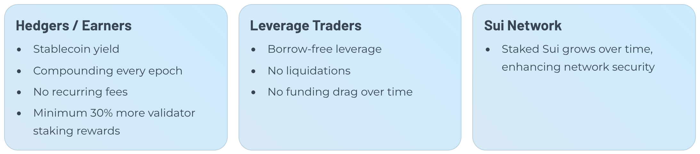
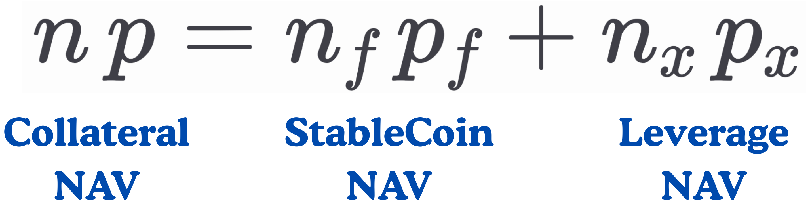

# Leafsii

video: https://youtu.be/DpMgGGcFmTw

Leafsii is an **FXN-style, no-liquidation leverage protocol** on Sui that splits collateral into a stable fToken and a high-beta xToken, now extended cross-chain with ETH collateral via Walrus.

## Impact

Hedgers / Yield: Stablecoin • Compounds each epoch • No recurring fees • ≥1.3× validator staking yield

Leverage traders: Borrow-free leverage • No liquidations • No funding drag over time

Sui Network: Stake grows over time → stronger security

## Mechanism

### Core Equation

The user deposits SUI as collateral and mints stablecoins (fToken) or leverage tokens (xToken) as desired. Changes in the collateral’s NAV are transferred to the leveraged side (xToken), while fToken remains stable. See the example below.

### Example Price Up

• Start: `NAV = 100`, `n_f = 60`, `n_x = 1` → `p_x = (100 − 60)/1 = 40`.
• If market **+20%** → `NAV = 120` → `p_x = 60` (**+50%**).

### Example Price Down

• If market **−20%** → `NAV = 80` → `p_x = 20` (**−50%**).

The equality holds by design. The protocol maintains a Collateral Ratio of at least 1.30×. As CR shifts, policy bands adjust fees and bonuses; if needed, the Stability Pool burns fToken deposits (with deferred claims) to recapitalize the system—avoiding auctions and liquidations.

## Stability Pool
Depositors park their fToken in a shared buffer that automatically cancels bad debt by burning the pool's fToken against undercollateralized positions and transferring the seized reserve asset back to depositors. This keeps the system solvent without fire-sale auctions, while stakers earn the liquidated reserve plus streaming LFS incentives and gauge-directed emissions for providing that backstop. Over time, net inflows from liquidations and rewards compound the yield for Stability Pool participants.

## Token Economics

### Stability Pool Yield
Stability Pool depositors earn yield on their parked fToken as the pool retires undercollateralized debt. Seized SUI flows back to depositors, and every epoch adds LFS incentives plus any validator staking yield captured from recapitalized positions. Rewards auto-compound as they remain in the pool, turning Stability Pool participation into a native source of dollar-denominated yield.

### Boosting With veLFS
Locking LFS for veLFS multiplies a user’s share of Stability Pool, liquidity, and validator rewards. Longer locks and larger balances translate into higher personal multipliers, so active backstoppers and LPs can boost their real yield without adding risk. veLFS holders also earn protocol fees routed to the gauge they support, reinforcing long-term alignment.
### Voting Rights
veLFS provides dual governance channels:
*  dynamic gauge voting system lets lockers allocate weekly emissions across the Stability Pool, preferred liquidity pairs, and other incentive targets, so veLFS holders decide where new LFS rewards flow.
lockers steer where LFS rewards flow.
* Validator voting assigns protocol-owned SUI to preferred validators, shaping the staking set while sharing staking yield with the decisions’ supporters. 

These mechanisms keep safety incentives, liquidity, and validator alignment in sync with the stakeholders who lock LFS for the long haul.

## Cross-Chain Architecture

Leafsii extends its no-liquidation leverage design across chains using a three-layer architecture:

- **Layer 1 – Ethereum (vault)**: a minimal `WalrusEthVault` contract on Ethereum holds ETH collateral, tracks user shares, and supports self-custody withdrawals via signed vouchers.
- **Layer 2 – Walrus (data availability)**: the vault periodically publishes Merkle roots of balances and related proofs to Walrus, creating immutable checkpoints of the Ethereum collateral state.
- **Layer 3 – Sui (core protocol)**: Move contracts on Sui verify Walrus checkpoints, register cross-chain collateral, and then mint/burn fTokens and xTokens with the same FXN-style, no-liquidation mechanics as the native Sui market. A Go backend and React frontend sit on top for indexing, quotes, and trading UI.

This keeps all complex leverage logic on Sui while letting users fund positions with ETH from Ethereum.

## How Walrus Helps Leafsii

Walrus is the trust-minimized bridge layer that connects Ethereum collateral to Sui logic:

- **Proofs, not wrapped assets** – instead of minting wrapped ETH controlled by a bridge, Leafsii uses Walrus checkpoints and Merkle proofs so Sui can verify ETH balances directly.
- **No external bridge validator set** – trust is concentrated in a small Ethereum vault plus Sui + Walrus; there is no separate bridge multisig or relayer set that can be compromised.
- **Batching and lower costs** – one Walrus checkpoint can serve many users and many mints, reducing per-user cross-chain messaging and keeping fees low.
- **Keeps “no-risk leverage” intact** – Walrus only proves where the ETH is and who owns it; all risk logic (CR, stability pool, FXN-style payoff) remains enforced by Move on Sui, so the core no-liquidation design is preserved even when collateral lives on another chain.
